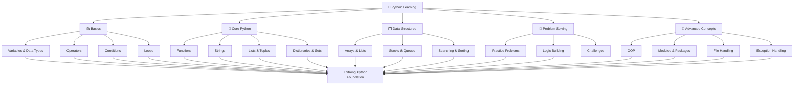

# 🐍 Python Projects
A comprehensive collection of **Python programs** and projects showcasing practical solutions, coding best practices, and ``` real-world``` applications.

---

## 🔀 Learning Journey



---

# 🐍 Python Projects Repository

Welcome to my **Python Projects Repository**!  
This repository contains a collection of **Python programs** and mini projects that I built while learning and practicing **Python programming**.

The main goal of this repository is to strengthen my understanding of **Python fundamentals, problem-solving skills, and ```real-world ``` programming concepts**.

---

## 📌 About This Repository

This repository includes different types of **Python programs** such as:

- Beginner level Python ```scripts.```
- Practice problems.
- Logic building exercises.
- Small automation scripts.
- Mini Python ```projects.```

All the programs are written using **clean and beginner-friendly code** so that anyone learning Python can easily understand them.

---

## 📌 Git Clone Command
```bash
git clone https://github.com/sumitkumar2374/python.py-code.git
```

## 🚀 Technologies Used

- **Python 3**
- Command Line ```Interface (CLI).```
- **Basic Python Libraries**.

## 📌 Author

Created by **Mr Sumit Kumar**
